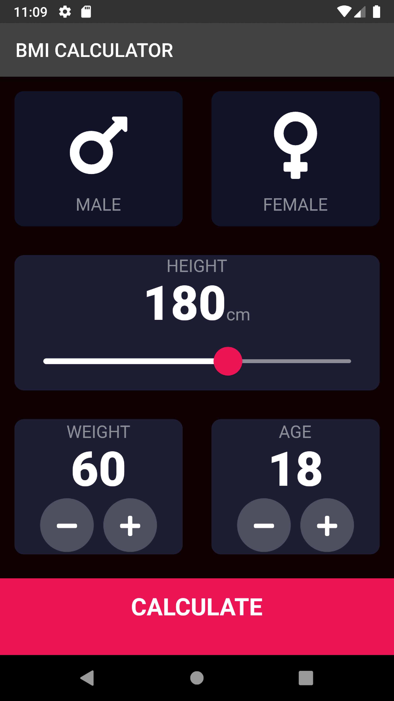
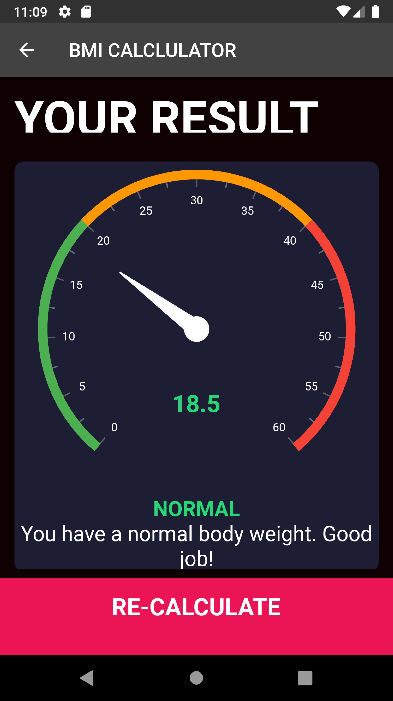

# BMI_Calculator

Application designed to calculate the Body Mass Index of any person.

UI of the application
<table>
 <tr>
    <td></td>
    <td></td>
  </tr>
 </table>

User can select their Gender, Height, Weight and Age

Upon clicking, the CALCULATE button at the bottom of the screen the page navigates to a new screen where

BMI of the individual is shown.

